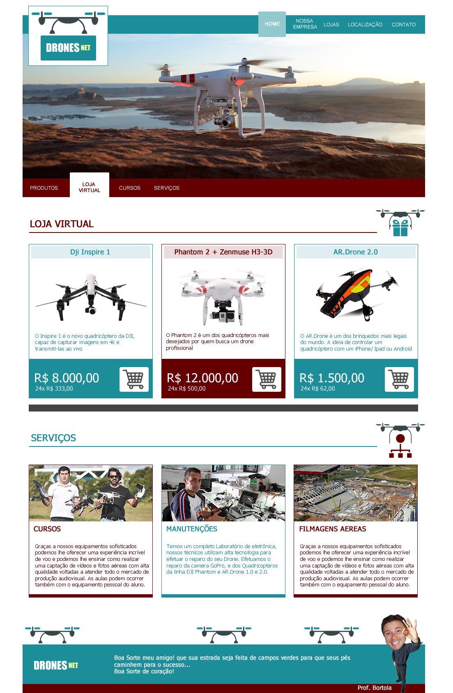

## Hi👋 welcome to DronesNET repository!!

The purpose of this repository is to develop a static website based on the model below.

> Model



---

> Deploy

You can preview this project online by accessing the link [link](link)

---

> Run locally

You can run it locally by following the commands below on your terminal.

- clone the project

```cmd
git clone git@github.com:phtoselli/drones-net.git
```

- open the folder you just cloned

```cmd
cd drones-net
```

- open `index.html` file

```cmd
open index.html
```

You can add content and styles however you want by changing the `index.htm` and `style.css` files.
